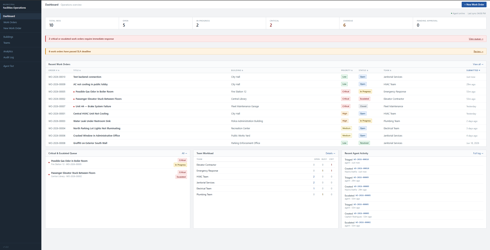
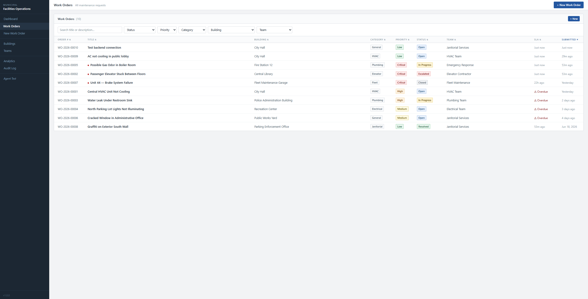
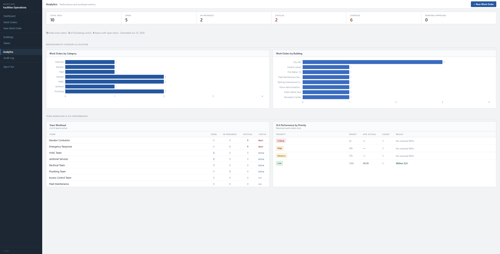

# Municipal Facilities Operations Agent

A full-stack internal operations platform where city staff submit building maintenance work orders. An AI triage agent classifies each request, assigns urgency, routes it to the correct maintenance team, estimates an SLA deadline, detects escalation risk, and recommends the next action — all before a human touches the ticket.

Built as an internship sample project demonstrating agentic AI integration in a public-sector context.

---

## What It Does

City staff submit a maintenance request through a web interface. Behind the scenes:

1. **AI triage** classifies the issue by category (HVAC, Plumbing, Electrical, etc.), assigns a priority, picks the right team, and calculates an SLA deadline
2. **Safety escalation** fires automatically when the description contains critical keywords — gas smell, water near electrical equipment, structural collapse, brake failure, and more
3. **Compound hazard detection** catches cross-category emergencies: water + electrical panel, or gas odor + boiler room, each routed to Emergency Response rather than the individual trade team
4. **Approval thresholds** flag work orders for manager sign-off when estimated cost exceeds $2,500, or director approval above $10,000
5. **Full audit trail** records every event — creation, triage decision, status change, reassignment, escalation, approval — in an immutable log
6. **Analytics** track open counts, overdue SLAs, team workload, and priority distribution across all buildings

---

## Key Features

| Feature | Detail |
|---------|--------|
| AI triage agent | Gemini API when key is set; deterministic rule-based fallback otherwise |
| Compound hazard detection | Water + electrical, gas + boiler context both produce critical overrides |
| Public-area priority bump | Issues in lobbies, reception areas, courtrooms get one priority level higher |
| SLA tracking | Critical = 2 h · High = 24 h · Medium = 72 h · Low = 168 h |
| Status lifecycle | open → in_progress → pending_approval → resolved → closed (+ escalated) |
| Work order notes | Internal notes thread per work order |
| Audit log | Full event history with actor, old/new values, and structured detail |
| 8 seed buildings | City Hall, Library, Fire Station, Police Admin, Fleet Garage, and more |
| 8 seed teams | HVAC, Plumbing, Electrical, Elevator Contractor, Fleet, Janitorial, Access Control, Emergency Response |
| 9-page frontend | Dashboard, Work Orders, New WO, WO Detail, Buildings, Teams, Analytics, Audit Log, Agent Test |

---

## Tech Stack

| Layer | Technology |
|-------|-----------|
| Backend | Python 3.11+, FastAPI, SQLAlchemy 2, SQLite |
| AI Agent | Google Gemini API (`gemini-1.5-flash` default) with rule-based fallback |
| Frontend | React 18, Vite, TypeScript, TanStack Query v5, React Router v6, Recharts |
| Styling | Plain CSS with CSS custom properties (design tokens — no Tailwind) |
| Testing | pytest 8, httpx, SQLite in-memory test database |

---

## Project Structure

```
municipal-facilities-operations-agent/
├── backend/
│   ├── app/
│   │   ├── main.py          # FastAPI app, startup seed
│   │   ├── config.py        # Settings from .env
│   │   ├── database.py      # SQLAlchemy engine and session
│   │   ├── models/          # ORM models (6 tables)
│   │   ├── schemas/         # Pydantic v2 request/response models
│   │   ├── routers/         # API route handlers (7 routers)
│   │   ├── services/        # triage_agent, sla_service, audit_service
│   │   └── seed/            # Seed data (buildings, teams, sample WOs)
│   ├── tests/               # 85 pytest tests
│   └── requirements.txt
├── frontend/
│   └── src/
│       ├── pages/           # 9 page components
│       ├── components/      # Layout, UI primitives, WO-specific components
│       ├── hooks/           # React Query data hooks
│       ├── api/             # Typed API call modules
│       ├── types/           # Shared TypeScript interfaces
│       └── styles.css       # Design system (CSS custom properties)
├── docs/                    # Architecture and prompt documentation
└── .env.example
```

---

## Setup — Backend

### Prerequisites
- Python 3.11 or later

### 1. Copy the environment file

```powershell
# Windows PowerShell
Copy-Item .env.example backend\.env
```

```bash
# macOS / Linux
cp .env.example backend/.env
```

Edit `backend/.env` and optionally add your `GEMINI_API_KEY`. Leave it blank to use the deterministic rule-based triage engine — everything works without it.

### 2. Create a virtual environment and install dependencies

```powershell
# Windows PowerShell
cd backend
python -m venv .venv
.venv\Scripts\Activate.ps1
pip install -r requirements.txt
```

```bash
# macOS / Linux
cd backend
python -m venv .venv
source .venv/bin/activate
pip install -r requirements.txt
```

### 3. Start the API server

```powershell
uvicorn app.main:app --reload
```

- API base URL: **http://localhost:8000**
- Interactive docs: **http://localhost:8000/docs**
- ReDoc: **http://localhost:8000/redoc**

On first startup the server creates the SQLite database, seeds 8 buildings, 8 teams, and 8 realistic sample work orders with triage results.

---

## Setup — Frontend

### Prerequisites
- Node.js 18 or later

```powershell
# From the project root (new terminal, keep backend running)
cd frontend
npm install
npm run dev
```

- App URL: **http://localhost:5173**

The Vite dev server proxies all `/api/*` requests to the FastAPI backend on port 8000, so both must be running simultaneously.

---

## Running Tests

```powershell
cd backend
.venv\Scripts\Activate.ps1
pytest tests/ -v
```

85 tests covering buildings, teams, work orders, triage rule-based engine (all priority/category/compound-hazard cases), SLA service, and analytics.

---

## Environment Variables

| Variable | Default | Description |
|----------|---------|-------------|
| `GEMINI_API_KEY` | *(empty)* | Enables Gemini AI triage. Leave blank for rule-based fallback. |
| `GEMINI_MODEL` | `gemini-1.5-flash` | Any valid Gemini model ID. Change here, not in code. |
| `DATABASE_URL` | `sqlite:///./municipal_facilities.db` | SQLite path relative to `backend/`. |
| `APP_ENV` | `development` | Set to `test` to suppress seed data during automated tests. |

---

## API Endpoints

### Work Orders
| Method | Path | Description |
|--------|------|-------------|
| `GET` | `/api/work-orders` | List with filters: `status`, `priority`, `category`, `building_id`, `team_id`, `search` |
| `POST` | `/api/work-orders` | Create and auto-triage a work order |
| `GET` | `/api/work-orders/{id}` | Full detail with triage result and notes |
| `PATCH` | `/api/work-orders/{id}/status` | Update status |
| `PATCH` | `/api/work-orders/{id}/assign` | Reassign team |
| `POST` | `/api/work-orders/{id}/notes` | Add internal note |
| `POST` | `/api/work-orders/{id}/approve` | Record manager/director approval |

### Reference Data
| Method | Path | Description |
|--------|------|-------------|
| `GET` | `/api/buildings` | List all buildings |
| `GET` | `/api/teams` | List all teams |
| `GET` | `/api/teams/{id}/workload` | Open and critical WO counts for a team |

### Analytics & Audit
| Method | Path | Description |
|--------|------|-------------|
| `GET` | `/api/analytics` | Full overview: summary + by-category + by-building + by-team + SLA |
| `GET` | `/api/analytics/summary` | Counts only (total, open, critical, overdue, pending approval) |
| `GET` | `/api/audit-logs` | Filterable event log (`event_type`, `actor`, `work_order_id`) |

### AI Agent
| Method | Path | Description |
|--------|------|-------------|
| `POST` | `/api/triage` | Run triage without creating a work order |
| `POST` | `/api/agent/triage-preview` | Same as above — named endpoint demonstrating the agentic feature |

### System
| Method | Path | Description |
|--------|------|-------------|
| `GET` | `/api/health` | Health check |

---

## Example: AI Triage Request & Response

**Request — `POST /api/agent/triage-preview`**

```json
{
  "title": "Gas odor in boiler room",
  "description": "There is a strong gas smell in the boiler room at Fire Station 12. Staff evacuated the area.",
  "building": "Fire Station 12",
  "location_details": "Boiler room, adjacent to apparatus bay",
  "estimated_cost": null
}
```

**Response**

```json
{
  "category": "Plumbing",
  "priority": "critical",
  "assigned_team": "Emergency Response",
  "estimated_sla_hours": 2,
  "duplicate_risk": "low",
  "short_summary": "Critical Plumbing issue at Fire Station 12: Gas odor in boiler room",
  "recommended_next_action": "Dispatch Emergency Response immediately. Contact the gas utility company for emergency shutoff verification. Keep the area fully evacuated — do not allow re-entry until authorized personnel confirm the space is safe. Response required within 2 hours.",
  "risk_reasoning": "Category 'Plumbing' identified by keyword match. Priority 'critical' assigned based on gas safety compound hazard detected — gas odor/smell overrides normal category matching. Duplicate risk 'low' based on description specificity.",
  "requires_approval": false,
  "escalation_reason": "Gas safety event detected — possible gas odor or gas leak. Area must remain evacuated. Contact the gas utility company for emergency shutoff verification. Do not re-enter until cleared by authorized personnel.",
  "agent_mode": "rule_based"
}
```

> Note: `"boiler"` is in the HVAC keyword list but the gas safety compound detector runs first and correctly overrides the category to Plumbing with Emergency Response routing.

---

## Screenshots

### Dashboard


### Work Orders


### Analytics


---

## Documentation Files

| File | Contents |
|------|----------|
| [BUSINESS_STATEMENT.md](BUSINESS_STATEMENT.md) | Problem, solution, target users, and scope |
| [LOGICAL_STRUCTURE.md](LOGICAL_STRUCTURE.md) | Module map, data flow, status lifecycle, SLA rules |
| [TECHNICAL_IMPLEMENTATION_GUIDE.md](TECHNICAL_IMPLEMENTATION_GUIDE.md) | Setup, config reference, how to extend |
| [GEMINI_SYSTEM_PROMPT.md](GEMINI_SYSTEM_PROMPT.md) | The system prompt and user prompt template used by the AI agent |
| [SAMPLE_TEST_PROMPTS.md](SAMPLE_TEST_PROMPTS.md) | 12 realistic triage scenarios with expected outputs |

---

## Project Status & Limitations

**Implemented**
- Full backend API with SQLite persistence
- Rule-based triage engine (works with no external dependencies)
- Gemini AI integration with automatic fallback
- 9-page React frontend — all pages functional and connected to the API
- 85 backend tests with full triage, SLA, and work order coverage
- Audit log for every state change
- Seed data for realistic demo use

**Not implemented in this version**
- User authentication and role-based access (no login — all actions are open)
- Email or SMS notifications
- File attachment support on work orders
- Multi-tenant support
- Production deployment configuration (Docker, Nginx, etc.)
- Real-time updates (no WebSocket — requires page refresh or React Query refetch interval)
